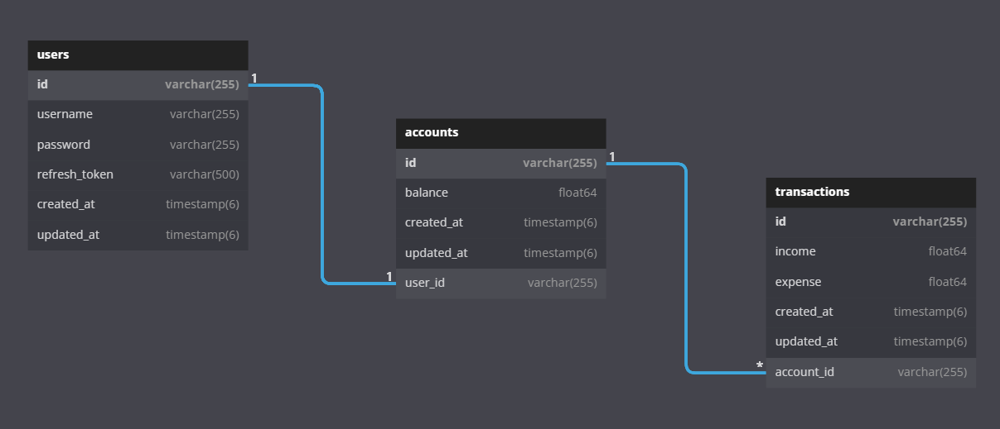

<h1>⚡️ Paper Plane Project</h1>
<p>This is a small project to managing a ledger as <strong><i>API</i></strong> that was done by <strong><i>Golang + Fiber</i></strong>.</p>
<p> 
I've got a full-time job as a <strong><i>backend developer</i></strong>. So I need to improve my skill. It's no good if I still lazy after work. It's the reason why this project has been established.</p>

<h2>📝 Quick Start</h2>
<h3>Installation</h3>
<ul>
    <li>MySQL 🐬</li>
    <li>Xampp 🦴</li>
    <li>Golang 🦫</li>
    <li>Postman 👨🏽‍🚀</li>
    <li>Air (Hot Reload)⚡️</li>
</ul>

```bash
git clone https://github.com/Rayato159/paper-plane-backend
cd ./paper-plane-backend
go get ./...
air
```

<h3>Database Schema</h3>


<h3>Function Lists</h3>
<strong>🔒 Authentication</strong>
<ul>
    <li>Login</li>
    <li>Refresh Token</li>
</ul>
<strong>🧑‍💻 Users</strong>
<ul>
    <li>Register</li>
    <li>Remove User</li>
</ul>
<strong>🧾 Accounts</strong>
<ul>
    <li>Get Account Info</li>
</ul>
<strong>💵 Transactions</strong>
<ul>
    <li>Add Transaction</li>
    <li>Get Transaction By Id</li>
    <li>Get Transaction Lists</li>
    <li>Edit Transaction</li>
    <li>Remove Transaction</li>
</ul>

<h3>Test the API with Postman</h3>
<p><strong>Postman collection and environment were in this repository. </strong>You just need to clone and import a collection and an environment into the Postman. Then have fun!
<p>Don't be worry, all examples were added.</p>